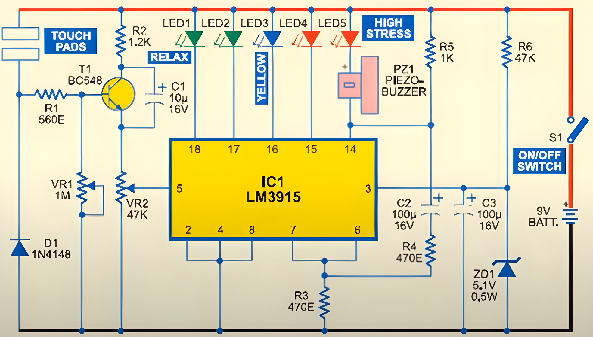

# Stress‑Meter: Standalone Thumb‑Press Stress Detection Device

**First‑year BTech Electrical Engineering project (2020–21): NI Multisim simulation of a standalone stress‑meter activated by thumb‑press sensor**

---

## Table of Contents

* [Project Overview](#project-overview)
* [Circuit Design & Operation](#circuit-design--operation)
* [Technical Specifications](#technical-specifications)
* [Folder Structure](#folder-structure)
* [Installation & Simulation](#installation--simulation)
* [Data & Results](#data--results)
* [Contributors](#contributors)
* [Contact](#contact)

---

## Project Overview

This project simulates a **standalone stress‑meter** that activates when the user presses their thumb on a sensor pad. The device amplifies skin‑conductance variations and displays stress levels on a logarithmic LED bar, with an audio alert for high stress.

---

## Circuit Schematic



### Signal Amplification

* **Transistor Stage**: A BC548 (T1) configured as a common‑emitter amplifier boosts voltage changes from the thumb sensor pad. The base is driven through resistor R1 and adjustable via potentiometer VR1 to set sensitivity.
* **Biasing & Stabilization**: Diode D1 provides stable bias for T1’s base; capacitor C1 decouples the emitter, ensuring steady amplification without oscillations.

### Logarithmic LED Display

* **Driver IC**: Amplified signal feeds LM3915 (IC1), which drives five LEDs (pins 14–18) in logarithmic increments of \~125 mV per step. LED1 lights at 150 mV; LED5 and buzzer activate at ≥650 mV.
* **Alarm Mechanism**: R4, R5, and C2 form the LED flashing circuit; when stress threshold is exceeded, LED5 flashes and piezo buzzer PZ1 beeps.

### Power Regulation

* **Supply**: Zener diode ZD1 with R6 establishes a 5 V regulated rail.
* **Decoupling**: Capacitor C3, placed close to IC1’s supply pin, filters noise and prevents false triggering.

---

## Technical Specifications

| Component    | Value / Type                   | Purpose                             |
| BC548 (T1)   | NPN transistor, common‑emitter | Signal amplification                |
| LM3915 (IC1) | Logarithmic LED driver         | Stress‑level display                |
| R1, VR1      | 10 kΩ + 10 kΩ potentiometer    | Input bias & sensitivity adjustment |
| R3           | 220 Ω                          | LED current limiting (\~20 mA)      |
| R4, R5, C2   | 1 kΩ, 10 µF                    | LED flash oscillator                |
| ZD1, R6      | 5 V Zener + 1 kΩ               | Voltage regulation                  |
| C1, C3       | 100 nF each                    | Decoupling                          |
| PZ1          | Piezo buzzer                   | Audio alert                         |

---

## Folder Structure

```
stress‑meter/
├── README.md                     # Project overview and instructions  
├── docs/
│   ├── slides.pdf                # Presentation PDF  
│   └── slides.pptx               # Original PPTX  
├── simulation/
│   ├── multisim/                 # NI Multisim files  
│   └── results.csv               # Voltage vs. LED state data  
├── src/                          # Placeholder for future code  
└── assets/
    ├── schematic.png             # Circuit diagram screenshot  
    └── demo.gif                  # Simulation animation  
```

---

## Installation & Simulation

1. **Clone the repo**

   ```bash
   git clone https://github.com/Siddharthsinghkumar/stress-meter.git  
   cd stress-meter  
   ```
2. **Open in NI Multisim**

   * Load `simulation/multisim/stress-meter.ms14`
   * Run transient analysis to view LED thresholds.
3. **View Slides**

   * Open `docs/slides.pdf` for design rationale and test results.

---

## Data & Results

The `results.csv` includes time‑stamped voltage readings and illuminated LED count:

* **time\_ms**: Simulation time (ms)
* **vin\_mV**: Input pad voltage (mV)
* **led\_count**: Number of LEDs lit (0–5)
* **alarm**: 1 when buzzer activates

---

## Contributors

Siddharth Singh: Circuit analysis and Multisim simulation
Friend A: Presentation slides
Friend B: Project report


## Contact

**Siddharth Singh**

* GitHub: [Siddharthsinghkumar](https://github.com/Siddharthsinghkumar)
* LinkedIn: [siddharth-singh-735340296](https://www.linkedin.com/in/siddharth-singh-735340296/)
* Email: [siddharths@duck.com](mailto:siddharths@duck.com)
